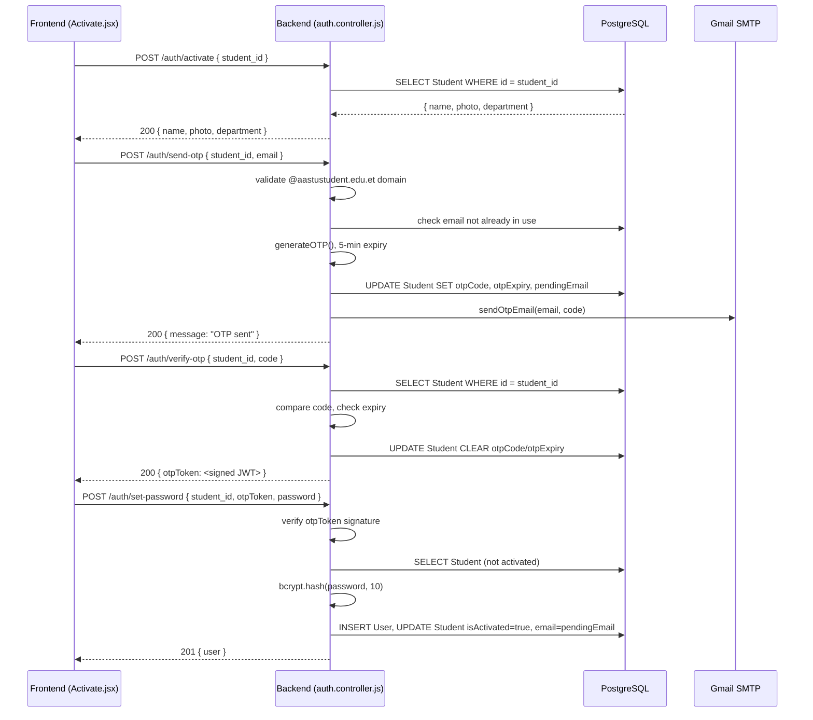

# Design Document — AASTU Student Identity Activation

## Overview

This design refactors the student account activation flow to require verified ownership of an official AASTU institutional email (`@aastustudent.edu.et`) before a password can be set. The current flow collects an email at the password step with no verification. The new flow inserts an OTP email verification step between identity confirmation and password creation, making the system enterprise-grade.

The existing admin preload system, guard verification, and laptop systems are untouched. Manual student self-registration is removed.

---

## Architecture

The activation flow is a 4-step wizard:

```
Step 1: Student ID input
        ↓ POST /api/auth/activate  (lookup by student_id)
Step 2: Identity confirmation (photo, name, department)
        ↓ (client confirms)
Step 3: Institutional email input + OTP verification
        ↓ POST /api/auth/send-otp  (validate domain, generate OTP, send email)
        ↓ POST /api/auth/verify-otp  (check OTP, mark session verified)
Step 4: Password creation
        ↓ POST /api/auth/set-password  (requires verified OTP token, hashes password, activates account)
```

OTP state is stored server-side in the `Student` table (temporary columns), never in the client. A short-lived signed token is returned after OTP verification to authorize the `set-password` call.



---

## Components and Interfaces

### Backend

**`backend/src/lib/authUtils.js`** (extend existing)
- `isInstitutionalEmail(email): boolean` — already exists, validates `@aastustudent.edu.et`
- `generateOTP(): string` — already exists, returns 6-digit numeric string
- `generateOTPExpiry(minutes?: number): Date` — update to accept a minutes parameter (default 5)
- `generateOtpToken(studentId, email): string` — new, signs a short-lived JWT (10 min) encoding `{ studentId, email, purpose: 'otp-verified' }`
- `verifyOtpToken(token): { studentId, email } | null` — new, verifies and decodes the OTP token

**`backend/src/lib/email.service.js`** (extend existing)
- `sendOtpEmail(to, code): Promise<void>` — new function, sends activation OTP with 5-minute expiry notice
- Keep existing `sendVerificationEmail` for password reset

**`backend/src/controllers/auth.controller.js`** (modify)
- `activateStudent(req, res)` — update: accept only `student_id` (remove username requirement per new flow)
- `sendOtp(req, res)` — new: validate email domain, check duplicate, generate OTP, store on Student, send email
- `verifyOtp(req, res)` — new: compare OTP, check expiry, clear OTP fields, return signed otpToken
- `setPassword(req, res)` — update: accept `otpToken` instead of `email`; verify token; proceed with activation
- `forgotPassword`, `resetPassword` — keep existing logic unchanged

**`backend/src/routes/auth.routes.js`** (modify)
- Add `POST /auth/send-otp` → `sendOtp`
- Add `POST /auth/verify-otp` → `verifyOtp`
- Apply rate limiter to `/send-otp` (5 requests / 15 min per IP)

### Frontend

**`frontend/src/pages/Activate.jsx`** (refactor)
- Step 1: Student ID input only (username derived internally via `usernameFromStudentId`)
- Step 2: Identity confirmation (unchanged)
- Step 3: Email input + OTP verification (new combined step or two sub-steps)
  - Email input → calls `POST /auth/send-otp`
  - OTP input + Resend button → calls `POST /auth/verify-otp`
- Step 4: Password + confirm password (no email field — email already verified)

Step indicator updates from 3 dots to 4 dots.

---

## Data Models

### Schema changes to `Student` table

Add three temporary columns to hold OTP state during activation:

```prisma
model Student {
  id           String  @id
  username     String  @unique
  name         String
  email        String? @unique
  photo        String?
  department   String
  passwordHash String? @map("password_hash")
  isActivated  Boolean @default(false)

  // OTP activation state (cleared after successful verification)
  otpCode      String?
  otpExpiry    DateTime?
  pendingEmail String?   // holds the email being verified before activation completes

  user User?
}
```

No changes to `User`, `Laptop`, `GateLog`, `GuestPass`, or `LaptopUpdateRequest`.

### OTP Token (JWT payload)

```json
{
  "studentId": "ETS023/15",
  "email": "bethel.berihun@aastustudent.edu.et",
  "purpose": "otp-verified",
  "iat": 1234567890,
  "exp": 1234568490
}
```

Signed with `JWT_SECRET`, expires in 10 minutes. Passed from frontend to `set-password` as `otpToken`.

---

## Correctness Properties

*A property is a characteristic or behavior that should hold true across all valid executions of a system — essentially, a formal statement about what the system should do. Properties serve as the bridge between human-readable specifications and machine-verifiable correctness guarantees.*

**Property 1: Institutional email domain enforcement**
*For any* string submitted as an email to `send-otp`, if the string does not end with `@aastustudent.edu.et`, the system should return a 400 response and no OTP should be stored or sent.
**Validates: Requirements 3.1, 3.2**

**Property 2: OTP expiry enforcement**
*For any* student with a stored OTP whose expiry timestamp is in the past, submitting that OTP to `verify-otp` should return a 400 response.
**Validates: Requirements 4.4**

**Property 3: OTP clearance after verification**
*For any* student who successfully verifies their OTP, the `otpCode` and `otpExpiry` fields on the `Student` record should be null after the call completes.
**Validates: Requirements 4.6**

**Property 4: OTP token round-trip**
*For any* `studentId` and verified institutional email, generating an OTP token and then verifying it should return the same `studentId` and `email`.
**Validates: Requirements 4.2, 5.4**

**Property 5: Password creation requires valid OTP token**
*For any* call to `set-password` that includes an invalid, expired, or tampered `otpToken`, the system should return a 400 or 401 response and no `User` record should be created.
**Validates: Requirements 5.1, 5.4**

**Property 6: Activation is idempotent — already-activated students are rejected**
*For any* student with `isActivated = true`, calling `send-otp`, `verify-otp`, or `set-password` should return a 409 response.
**Validates: Requirements 1.4, 6.3**

**Property 7: Duplicate email rejection**
*For any* institutional email already associated with an activated account, calling `send-otp` with that email should return a 409 response.
**Validates: Requirements 3.3**

**Property 8: Password bcrypt round-trip**
*For any* valid activation, the password stored in the `User` record should satisfy `bcrypt.compare(plaintext, stored) === true` and must not equal the plaintext.
**Validates: Requirements 5.3**

**Property 9: OTP resend resets expiry**
*For any* student with an existing OTP, calling `send-otp` again (resend) should generate a new OTP and a new 5-minute expiry, replacing the old values.
**Validates: Requirements 4.5**

---

## Error Handling

| Scenario | HTTP Status | Message |
|---|---|---|
| Student ID not found | 404 | "Student not found" |
| Student already activated | 409 | "Account already activated" |
| Email domain invalid | 400 | "Only AASTU institutional emails are allowed" |
| Email already in use | 409 | "Email already in use" |
| OTP mismatch | 400 | "Invalid verification code" |
| OTP expired | 400 | "Verification code has expired" |
| OTP token invalid/expired | 401 | "Session expired, please verify your email again" |
| Password too short | 400 | "Password must be at least 6 characters" |
| Rate limit exceeded | 429 | "Too many attempts, please try again later" |
| Email delivery failure | 500 | "Failed to send verification email" (SMTP details never exposed) |

---

## Testing Strategy

### Property-Based Testing (fast-check + Vitest)

The project already uses `fast-check` with `vitest`. All correctness properties above will be implemented as property-based tests in `backend/src/tests/aastu-student-identity.property.test.js`.

Each test runs a minimum of **100 iterations** (20 for DB-heavy tests due to cost).

Each test is tagged with:
```
// **Feature: aastu-student-identity, Property N: <property text>**
// **Validates: Requirements X.Y**
```

Properties to implement:
- Property 1 — email domain enforcement (pure function, 100 runs)
- Property 2 — OTP expiry enforcement (DB test, 50 runs)
- Property 3 — OTP clearance after verification (DB test, 50 runs)
- Property 4 — OTP token round-trip (pure function, 100 runs)
- Property 5 — set-password requires valid OTP token (DB test, 50 runs)
- Property 6 — already-activated rejection (DB test, 100 runs)
- Property 7 — duplicate email rejection (DB test, 50 runs)
- Property 8 — bcrypt round-trip (DB test, 20 runs)
- Property 9 — OTP resend resets expiry (DB test, 50 runs)

### Unit Tests

Unit tests in `frontend/src/pages/Activate.test.jsx` cover:
- Step 1 renders student ID input
- Step 2 displays photo, name, department from API response
- Step 3 shows email input, then OTP input after send
- Step 4 shows password + confirm fields
- Mismatched passwords show inline error without API call
- Resend button triggers `send-otp` again

### Integration Points

- `isInstitutionalEmail` is already tested in `backend/src/tests/auth.property.test.js` (Property 1)
- `generateOTP` and `generateOTPExpiry` are already tested there (Properties 2, 3)
- New `generateOtpToken` / `verifyOtpToken` are pure functions suitable for property testing
